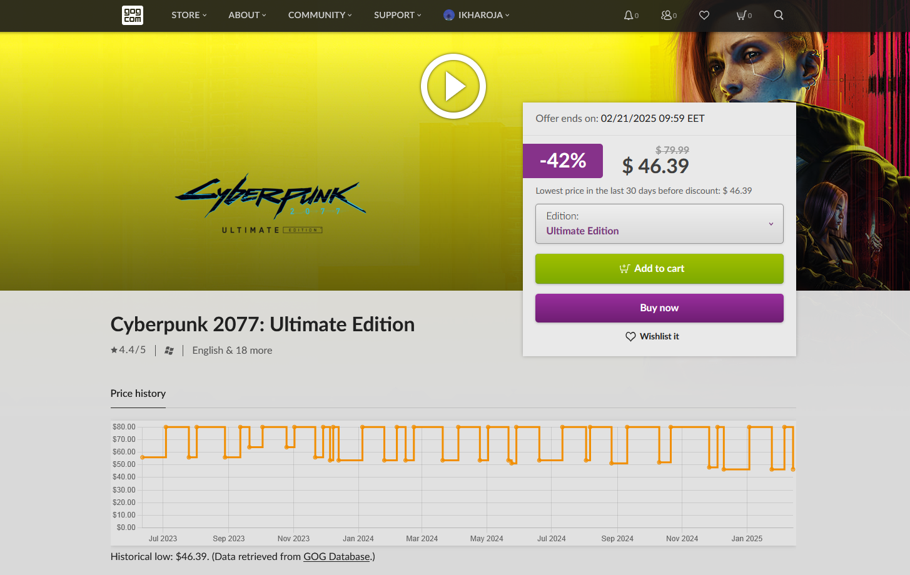

# GOG Price Charts

This userscript fetches historical price data from [GOG DB](https://www.gogdb.org/), then displays a price chart on each game's product page along with the lowest price. This helps you decide whether to buy a game now or wait for a better price.

The script only fetches data when you view an individual game's product page. Also, it caches data for 24 hours to limit unnecessary requests to GOG DB.

## Preview

## Compatibility
This script has only been tested with [Tampermonkey](https://addons.mozilla.org/en-US/firefox/addon/tampermonkey/) on [Firefox](https://www.mozilla.org/en-US/firefox/new/) and [Google Chrome](https://www.google.com/chrome/). However, it should also work with other script managers, like [Violentmonkey](https://addons.mozilla.org/en-US/firefox/addon/violentmonkey/), and with other modern browsers.

## Installation
1. Install a script manager for your browser:
    * **Firefox**: [Greasemonkey](https://addons.mozilla.org/en-US/firefox/addon/greasemonkey/), [Tampermonkey](https://addons.mozilla.org/en-US/firefox/addon/tampermonkey/) or [Violentmonkey](https://addons.mozilla.org/en-US/firefox/addon/violentmonkey/)
    * **Google Chrome** / **Vivaldi**: [Tampermonkey](https://chrome.google.com/webstore/detail/tampermonkey/dhdgffkkebhmkfjojejmpbldmpobfkfo) or [Violentmonkey](https://chrome.google.com/webstore/detail/violentmonkey/jinjaccalgkegednnccohejagnlnfdag)
    * **Microsoft Edge**: [Tampermonkey](https://microsoftedge.microsoft.com/addons/detail/tampermonkey/iikmkjmpaadaobahmlepeloendndfphd) or [Violentmonkey](https://microsoftedge.microsoft.com/addons/detail/violentmonkey/eeagobfjdenkkddmbclomhiblgggliao)
    * **Safari**: [Tampermonkey](https://apps.apple.com/app/tampermonkey/id6738342400)

2. If prompted, restart the browser.

3. Click to install from your preferred source: [GitHub](https://raw.githubusercontent.com/idkicarus/GOG-price-charts/main/gog-price-chart.user.js) or [Greasy Fork](https://greasyfork.org/en/scripts/527267-gogdb-price-charts).

## Issues
[Report an issue](https://github.com/idkicarus/gog-wishlist-sort/issues).
